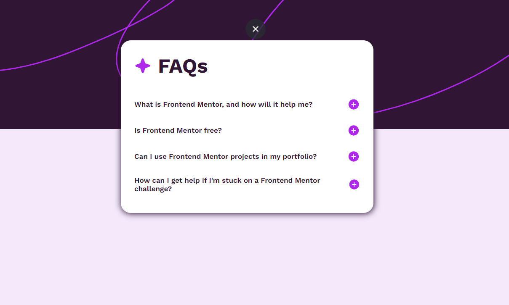
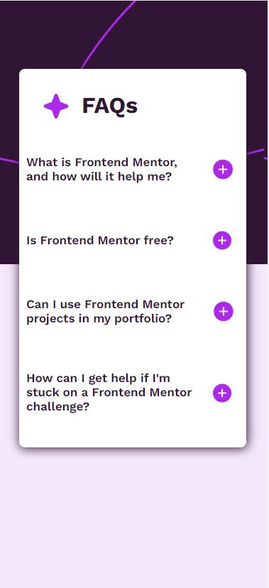

# Frontend Mentor - FAQ accordion solution

This is a solution to the [FAQ accordion challenge on Frontend Mentor](https://www.frontendmentor.io/challenges/faq-accordion-wyfFdeBwBz). Frontend Mentor challenges help you improve your coding skills by building realistic projects. 

## Table of contents

- [Overview](#overview)
  - [The challenge](#the-challenge)
  - [Screenshot](#screenshot)
  - [Links](#links)
- [My process](#my-process)
  - [Built with](#built-with)
  - [What I learned](#what-i-learned)
  - [Continued development](#continued-development)
  - [Useful resources](#useful-resources)
- [Author](#author)

**Note: Delete this note and update the table of contents based on what sections you keep.**

## Overview

### The challenge

Users should be able to:

- Hide/Show the answer to a question when the question is clicked
- Navigate the questions and hide/show answers using keyboard navigation alone
- View the optimal layout for the interface depending on their device's screen size
- See hover and focus states for all interactive elements on the page

### Screenshot
#### Desktop Preview 

#### Mobile Preview

### Links

- Live Site URL: ( https://faisal786111.github.io/FAQ/)

## My process

### Built with

- Semantic HTML5 markup
- CSS custom properties
- Flexbox
- Mobile-first workflow

**Note: These are just examples. Delete this note and replace the list above with your own choices**

### What I learned

I gained valuable insights into the proper usage of the HTML `
` tag. This versatile tag allows for the creation of interactive content, and I deepened my understanding of its functionality. To enhance my comprehension, I referred to a comprehensive guide available at [SitePoint](https://www.sitepoint.com/style-html-details-element/).

### Continued development

#### 1. **Advanced HTML and CSS Techniques**

I aim to deepen my understanding of advanced HTML and CSS techniques to enhance the visual appeal and responsiveness of my web projects. This includes exploring newer features, such as grid layouts and flexbox, and mastering the art of creating seamless and visually appealing user interfaces.

#### 2. **JavaScript Proficiency**

To elevate my web development skills, I plan to focus on advancing my proficiency in JavaScript. This involves delving into more complex concepts, exploring modern frameworks, and honing my skills in asynchronous programming to create dynamic and interactive web applications.

#### 3. **Responsive Design**

Ensuring that my web projects are fully responsive across various devices is a priority. I will continue to refine my skills in responsive design, employing media queries effectively, and staying updated on best practices to provide users with a seamless experience regardless of their device.

### Useful resources

- [SitePoint](https://www.sitepoint.com/style-html-details-element/) - This helped me for learning `
` tag.
- [MS Powertoys](https://learn.microsoft.com/en-us/windows/powertoys/) - This helped me for picking the colors which I want. 

## Author

- Website - [Faisal Khan]( https://faisal786111.github.io/FAQ/)
- Frontend Mentor - [@Faisal786111](https://www.frontendmentor.io/profile/Faisal786111)
- Twitter - [@Faisal_DevLife](https://twitter.com/Faisal_DevLife)
